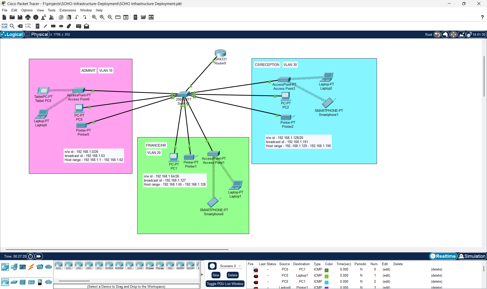

# SOHO-Infrastructure-Deployment

This project implements a fully functional small office network for any Company. The network is built using **Cisco devices** and designed to be **independent** of the headquarters, supporting structured VLANs, DHCP, wireless access, and inter-department communication.

---

## 📌 Requirements

- Use of **one Cisco router** and **one Cisco switch**
- **Three departments**:
  - Admin/IT
  - Finance/HR
  - Customer Service/Reception
- Each department should be on a **separate VLAN**
- Each VLAN should have **wireless access**
- All host devices must receive **dynamic IP addresses via DHCP**
- Departments should be able to **communicate across VLANs**

---

## 🧰 Tools & Technologies

- Cisco Packet Tracer
- Cisco Router (PT)
- Cisco Switch (2960)
- Wireless Access Points
- DHCP Protocol
- VLANs and Inter-VLAN Routing
- Trunking (802.1Q)
- IPv4

---

## 🧮 Subnetting Scheme

Given base network: `192.168.1.0`
Number of subnets: `3`
Calculated subnet mask: `255.255.255.192`
Block size: `64`

Subnetting used to create separate VLANs:

| VLAN | Department                  | Network Address             | Broadcast Address     | Gateway Address    | Range              |
|------|-----------------------------|-----------------------------|-----------------------|--------------------|--------------------|
| 10   | Admin / IT                  | 192.168.1.0/26              | 192.168.1.63          | 192.168.1.1        | 192.168.1.1 - .62  |
| 20   | Finance / HR                | 192.168.1.64/24             | 192.168.1.127         | 192.168.1.65       | 192.168.1.1 - .126 |
| 30   | Customer Service / Reception| 192.168.1.128/24            | 192.168.1.191         | 192.168.1.129      | 192.168.1.1 - .190 |

---

## 🗺️ Network Design Overview

### 🔧 VLAN Configuration

Each VLAN is configured on the switch and trunked to the router using **802.1Q** encapsulation.

### 📡 Wireless Access & SSIDs

Each department has its own SSID through a wireless access point mapped to the appropriate VLAN:

| Department                  | VLAN ID | SSID Name             |
|----------------------------|---------|------------------------|
| Admin / IT                 | 10      | `Admin@123`            |
| Finance / HR               | 20      | `Finance@123`          |
| Customer Service / Reception | 30    | `CS@123`               |

### 🔄 Inter-VLAN Routing

Router-on-a-Stick configuration used:

```bash
interface Gig0/0/0.10
 encapsulation dot1Q 10
 ip address 192.168.1.1 255.255.255.192

interface Gig0/0/0.20
 encapsulation dot1Q 20
 ip address 192.168.1.64 255.255.255.192

interface Gig0/0/0.30
 encapsulation dot1Q 30
 ip address 192.168.1.128 255.255.255.192
```
---

### 🛠 DHCP Configuration

```bash
serv dhcp
ip dhcp pool Admin-Pool
 network 192.168.1.0 255.255.255.192
 default-router 192.168.1.1
 dns-server 192.168.1.1
 domain-name Admin.com

ip dhcp pool Finance-Pool
 network 192.168.1.64 255.255.255.192
 default-router 192.168.1.65
 dns-server 192.168.1.65
 domain-name Finance.com

ip dhcp pool CS-Pool
 network 192.168.1.128 255.255.255.192
 default-router 192.168.1.129
 dns-server 192.168.1.129
 domain-name CS.com
```

---

## 🔐 Protocols Used

| Protocol         | Purpose                                |
|------------------|----------------------------------------|
| **DHCP**         | Dynamic IP assignment                  |
| **802.1Q**       | VLAN trunking between router and switch|
| **ICMP**         | Connectivity testing (ping)            |
| **ARP**          | Local address resolution               |

---

## 🖼️ Network Topology

Packet Tracer network implementation screenshot here:



---


